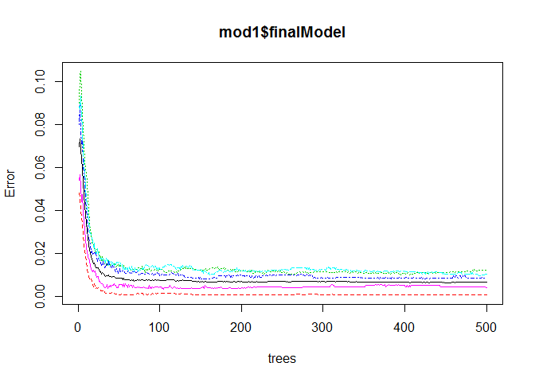
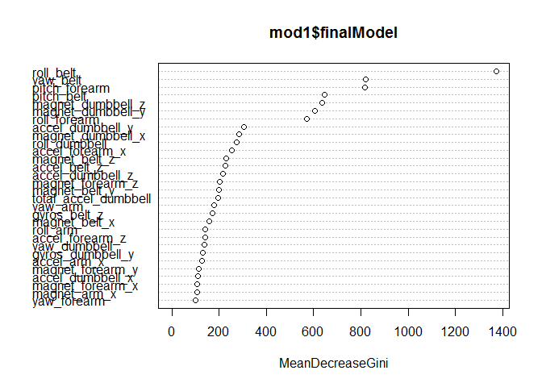

# Machine Learning Prediction Assignment
## Executive Summary

        I split the data into training and testing sets, with a 70% to 30% split based on classe.  I remove all of the other factor-like variables, and set the NA values to 0.  I use parallel computing and set 10 k-folds for cross-validation instead of bootstrapping all in the name of computing time savings.  I then train the model using a randomforest method with basic center and scale preprocessing.
        We see that the model predicts the training set perfectly, and the testing set with accuracy of 99.24%.  This lead to a successful prediction of the quiz set - with 20/20 predicted correctly.


## R Codework


```r
        require(caret)
```

```
## Loading required package: caret
```

```
## Warning: package 'caret' was built under R version 3.4.1
```

```
## Loading required package: lattice
```

```
## Loading required package: ggplot2
```

```r
        alldata<-read.csv("pml-training.csv",na.strings=c('#DIV/0', '', 'NA'),stringsAsFactors = FALSE)
        finalpredict<-read.csv("pml-testing.csv",na.strings=c('#DIV/0', '', 'NA'),stringsAsFactors = FALSE)
        
        #split data into tesing and training (70%/30%)
        set.seed(1777)
        trainingRows<-createDataPartition(alldata$classe, p=0.7, list=FALSE)
        training <- alldata[c(trainingRows),]
        testing <- alldata[c(-trainingRows),]
        
        #trim out columns not to be used
        training<-training[,8:160]
        classes <- as.character(sapply(training, class))
        colClasses <- which(classes=="character")
        training<- cbind(training[,-colClasses], as.factor(training$classe))
        names(training)[120]="classe"
        #zero out NAs
        training[is.na(training)]<-0
        
        
        #set-up parallel computing and cross validation to increase speed
        require(parallel)
```

```
## Loading required package: parallel
```

```r
        require(doParallel)
```

```
## Loading required package: doParallel
```

```
## Warning: package 'doParallel' was built under R version 3.4.1
```

```
## Loading required package: foreach
```

```
## Warning: package 'foreach' was built under R version 3.4.1
```

```
## Loading required package: iterators
```

```r
        cluster <- makeCluster(detectCores() - 1) # convention to leave 1 core for OS
        registerDoParallel(cluster)
        fitControl <- trainControl(method = "cv",
                           number = 10,
                           allowParallel = TRUE)
        
        #train random forest
        mod1<-train(classe~.,data=training,method="rf",preProcess=c("center","scale"),trControl=fitControl)
```

```
## Loading required package: randomForest
```

```
## Warning: package 'randomForest' was built under R version 3.4.1
```

```
## randomForest 4.6-12
```

```
## Type rfNews() to see new features/changes/bug fixes.
```

```
## 
## Attaching package: 'randomForest'
```

```
## The following object is masked from 'package:ggplot2':
## 
##     margin
```

```r
        #plot model
        plot(mod1$finalModel)
```

<!-- -->

```r
        varImpPlot(mod1$finalModel)
```

<!-- -->

```r
        #training results
        predtrain<-predict(mod1,training)
        confusionMatrix(predtrain,training$classe)
```

```
## Confusion Matrix and Statistics
## 
##           Reference
## Prediction    A    B    C    D    E
##          A 3906    0    0    0    0
##          B    0 2658    0    0    0
##          C    0    0 2396    0    0
##          D    0    0    0 2252    0
##          E    0    0    0    0 2525
## 
## Overall Statistics
##                                      
##                Accuracy : 1          
##                  95% CI : (0.9997, 1)
##     No Information Rate : 0.2843     
##     P-Value [Acc > NIR] : < 2.2e-16  
##                                      
##                   Kappa : 1          
##  Mcnemar's Test P-Value : NA         
## 
## Statistics by Class:
## 
##                      Class: A Class: B Class: C Class: D Class: E
## Sensitivity            1.0000   1.0000   1.0000   1.0000   1.0000
## Specificity            1.0000   1.0000   1.0000   1.0000   1.0000
## Pos Pred Value         1.0000   1.0000   1.0000   1.0000   1.0000
## Neg Pred Value         1.0000   1.0000   1.0000   1.0000   1.0000
## Prevalence             0.2843   0.1935   0.1744   0.1639   0.1838
## Detection Rate         0.2843   0.1935   0.1744   0.1639   0.1838
## Detection Prevalence   0.2843   0.1935   0.1744   0.1639   0.1838
## Balanced Accuracy      1.0000   1.0000   1.0000   1.0000   1.0000
```

```r
        #put testing in same format as training
        testing<-testing[,8:160]
        classes <- as.character(sapply(testing, class))
        colClasses <- which(classes=="character")
        testing<- cbind(testing[,-colClasses], as.factor(testing$classe))
        names(testing)[120]="classe"
        testing[is.na(testing)]<-0
        
        #testing results
        predtest<-predict(mod1,testing)
        confusionMatrix(predtest,testing$classe)
```

```
## Confusion Matrix and Statistics
## 
##           Reference
## Prediction    A    B    C    D    E
##          A 1670    8    0    0    0
##          B    3 1128    4    0    0
##          C    1    3 1016    8    2
##          D    0    0    6  955    7
##          E    0    0    0    1 1073
## 
## Overall Statistics
##                                           
##                Accuracy : 0.9927          
##                  95% CI : (0.9902, 0.9947)
##     No Information Rate : 0.2845          
##     P-Value [Acc > NIR] : < 2.2e-16       
##                                           
##                   Kappa : 0.9908          
##  Mcnemar's Test P-Value : NA              
## 
## Statistics by Class:
## 
##                      Class: A Class: B Class: C Class: D Class: E
## Sensitivity            0.9976   0.9903   0.9903   0.9907   0.9917
## Specificity            0.9981   0.9985   0.9971   0.9974   0.9998
## Pos Pred Value         0.9952   0.9938   0.9864   0.9866   0.9991
## Neg Pred Value         0.9990   0.9977   0.9979   0.9982   0.9981
## Prevalence             0.2845   0.1935   0.1743   0.1638   0.1839
## Detection Rate         0.2838   0.1917   0.1726   0.1623   0.1823
## Detection Prevalence   0.2851   0.1929   0.1750   0.1645   0.1825
## Balanced Accuracy      0.9979   0.9944   0.9937   0.9940   0.9957
```

```r
        #final quiz predictions
        finalpredict<-finalpredict[,8:160]
        finalpredict[is.na(finalpredict)]<-0
        
        predict(mod1,finalpredict)
```

```
##  [1] B A B A A E D B A A B C B A E E A B B B
## Levels: A B C D E
```

```r
        #stop parallel
        stopCluster(cluster)
        registerDoSEQ()
```


